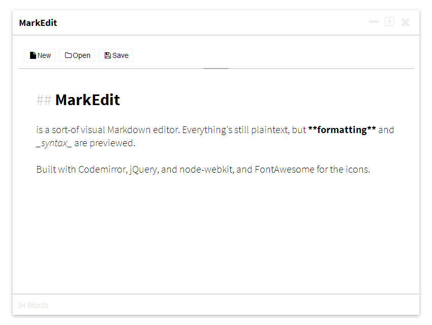

# MarkEdit

A sort-of visual Markdown editor. Runs on Codemirror and node-webkit.

Under active development.

## Screenshot

## Usage

Clone to desktop, then `cd` to the root directory of the project and run

    $ npm install
    $ bower install
    $ nw .

MarkEdit is tested and built with `node-webkit` v0.10.5. It is not guaranteed to run under earlier versions!

